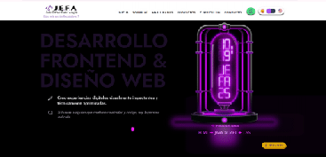
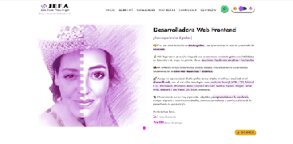
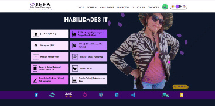
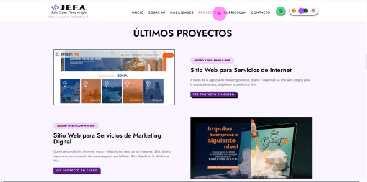
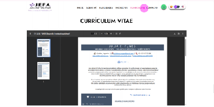
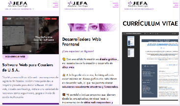

# 📌 Portfolio Personal

Este es el repositorio de mi portfolio personal, un sitio web diseñado para presentar mis habilidades como Desarrolladora Web y Diseñadora Gráfica.

## 🌐 Sobre el Proyecto

Este portfolio está estructurado en tres secciones principales, cada una enfocada en un público específico:

#### ✔ Agencias de Marketing 🏢

#### ✔ Clientes Particulares (Empresas y Comercios) 🛍️

#### ✔ Reclutadores y Empresas de Tecnología 👨‍💻

Cada sección está diseñada para ofrecer información relevante y adaptada a las necesidades de cada audiencia, destacando mis habilidades y experiencia en desarrollo web y diseño gráfico.

## 🚀 Tecnologías Utilizadas

El proyecto ha sido desarrollado utilizando las siguientes tecnologías y herramientas:

◻ Frontend: React.js (Create React App)

◻ Estilos: Tailwind CSS

◻ Gestión de Estado: Redux

◻ Animaciones: Framer Motion, React Type Animation, Gif Animator

◻ Manipulación de Cursores: react-animated-cursor

◻ Enrutamiento: React Router DOM

◻ Optimización de Imágenes: Formato WebP

## 📂 Estructura del Proyecto

### ⚡ Instalación y Ejecución

Si deseas ejecutar este proyecto en tu entorno local, sigue estos pasos:

1️⃣ Clonar el Repositorio

2️⃣ Instalar Dependencias

3️⃣ Ejecutar en Modo Desarrollo

Accede en tu navegador a http://localhost:3000

4️⃣ Construir para Producción

Genera los archivos optimizados en la carpeta build/.

### 🎨 Capturas de Pantalla

 

 

 

## 📬 Contacto

Si tienes alguna consulta o deseas colaborar, puedes contactarme en:

💌 Email: juliafunesaragon@gmail.com

⚡ LinkedIn: https://linkedin.com/in/je-funes

🚀 URL del Portafolio: https://jefa-web.com.ar

✨ ¡Gracias por visitar mi portfolio! 😊